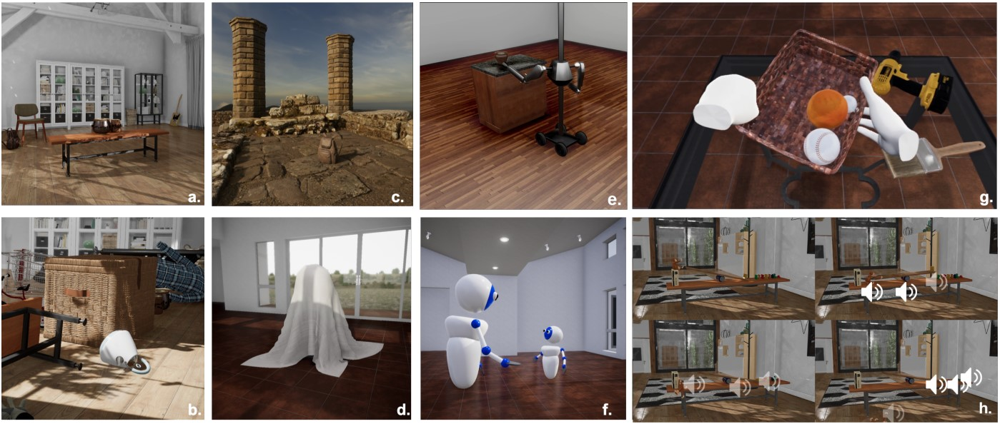

# Lab06 - Artigo de Dataset Público

# Aluno
* 236129: Guilherme Zeferino Rodrigues Dobins

# Análise do Artigo ThreeDWorld: A Platform for Interactive Multi-Modal Physical Simulation

| campo | valor |
|------------|----------------------------------------|
| referência | Gan, C., Schwartz, J., Alter, S., Mrowca, D. (2021). ThreeDWorld: A Platform for Interactive Multi-Modal Physical Simulation. NeurIPS 2021 Track Datasets and Benchmarks Round1|
| link       | [PDF](https://openreview.net/pdf?id=db1InWAwW2T) |
| dataset | O relatório não apresenta um dataset em si, e sim um sistema que é usado para gerar um dataset, ou simplesmente ser usado como o dataset, provendo imagens, áudios, simulações físicas, espaços para movimentação, entre outros. |
| formato | Por não se tratar de um dataset, e pelo fato de os dados serem extraídos diretamente da plataforma TDW, os dados podem ser de diferentes naturezas (áudios, imagens), logo não há um formato específico. |

## Resumo

O artigo apresenta uma plataforma de simulação física multi-modal, que apresenta imagens, áudios e interações físicas de alta-fidelidade. O objetivo principal da plataforma é utilizar essa simulação do mundo real para treinar modelos de machine learning e IA nesse ambiente, em vez de treiná-los no mundo real, visto que existem diversos empecilhos ao treinar um modelo interagindo com o mundo físico, como a limitação na velocidade de treinamento e possíveis acidentes. 

 

A fim de verificar a validade da proposta, os autores compararam modelos de machine learning treinados com dados gerados a partir do TDW, e compararam esse resultado com o de outros modelos, que foram treinados utilizando dados do mundo real, como os obtidos a partir de bancos de dados bem estabelecidos (ImageNet, por exemplo), e dados gerados a partir de simuladores com foco em uma única natureza de dados, como o AI2-Thor, focado em imagens, ou o iGibson, para navegação. Resumindo os resultados obtidos nessas comparações, foi verificado que, para modelos de detecção de imagem, o melhor modelo ainda foi o treinado a partir do database da ImageNet, no entanto o modelo treinado com dados gerados pelo TDW foram superiores aos demais, que utilizaram dados gerados por simuladores de imagem. Já na análise com dados de áudio, o modelo treinado a partir do TDW se mostrou mais de 30% superior ao treinado com dados do Sound-20K, que é um simulador apenas de áudios. Esses resultados mostram que, apesar de ainda não ser tão fiel quanto elementos retirados do mundo real, a ideia de realizar simulações multimodais não afetou as qualidades de aspectos específicos, isto é, tanto as imagens quanto os áudios gerados a partir desse modelo superaram os dados de simuladores de propósito único. 

Para corroborar com tal análise, também foram avaliadas as habilidades de intuição e predição física de um modelo treinado nessa plataforma. Para isso, foi utilizada uma rede neural  que depende de diversos tipos de materiais e representações 3D para funcionar do modo esperado. O resultado obtido apontou que, de fato, o uso de dados que misturam elementos visuais e sonoros permitiu uma maior precisão nos resultados, demonstrando novamente a utilidade da plataforma.

## Perguntas de pesquisa/análises

- Analisando a proposta, poderiamos perguntar: Um modelo de IA treinado em um cenário simulado poderia ser usado no mundo real? Quais vantagens um modelo multimodal apresenta em relação a simuladores de propósito único? 
- Dados os resultados na aplicação de previsões físicas, seria possível perguntar: De qual material certo objeto é feito? Dado que certo sistema de objetos/materiais está disposto de certa maneira, como ele deverá estar em um instante futuro? No contexto de carros autônomos, dados estes elementos na pista, qual ação deve ser tomada a fim de evitar acidentes e manter o trajeto do carro? 

## Trabalhos relacionados

- Eric Kolve, Roozbeh Mottaghi, Daniel Gordon, Yuke Zhu, Abhinav Gupta, and Ali Farhadi.
398 Ai2-thor: An interactive 3d environment for visual ai. Assim como o TDW, o AI2-Thor permite o uso de um ambiente simulado para gerar imagens que podem compor um dataset para treinamento de IAs.

- Damian Mrowca, Chengxu Zhuang, Elias Wang, Nick Haber, Li F Fei-Fei, Josh Tenenbaum,
414 and Daniel L Yamins. Flexible neural representation for physics prediction. In Advances in
415 Neural Information Processing Systems. Essa rede neural permite o treinamento a partir de elementos de diferentes materiais e texturas. Esse projeto, unido ao TDW, possibilita o uso de redes neurais treinadas em ambientes simulados para prever fenômenos físicos do mundo real.