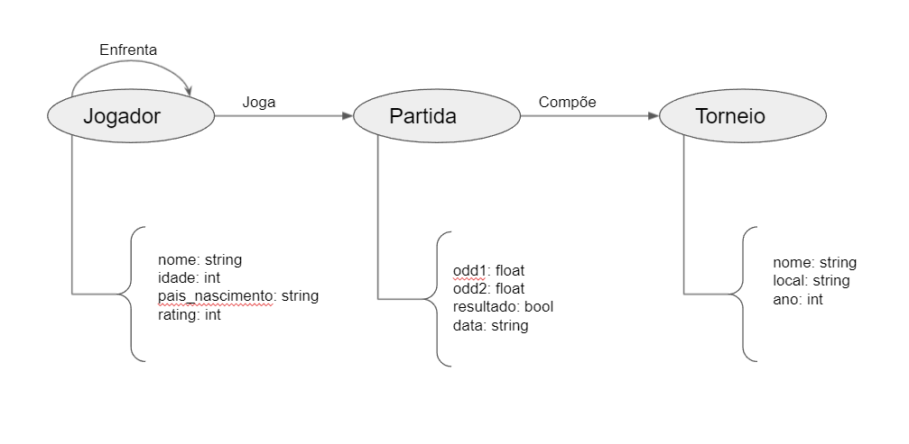

# Lab07 - Modelo Lógico para Banco de Dados de Grafos

# Aluno
* 236129: Guilherme Zeferino Rodrigues Dobins

## Modelo Lógico do Banco de Dados de Grafos

> 

## Perguntas de Pesquisa/análise

- A intuição nos diz que se um jogador tem muitas partidas jogadas e poucos torneios, ele tende a ir mais longe nas competições, então existe de fato uma relação entre quantidade de partidas que um jogador participou com o número de torneios jogados e seu rating? 

- Como o tempo de atividade de um jogador afeta sua popularidade?

- Como o torneio (nome do torneio) influencia nos odds de jogadores em determinadas partidas?